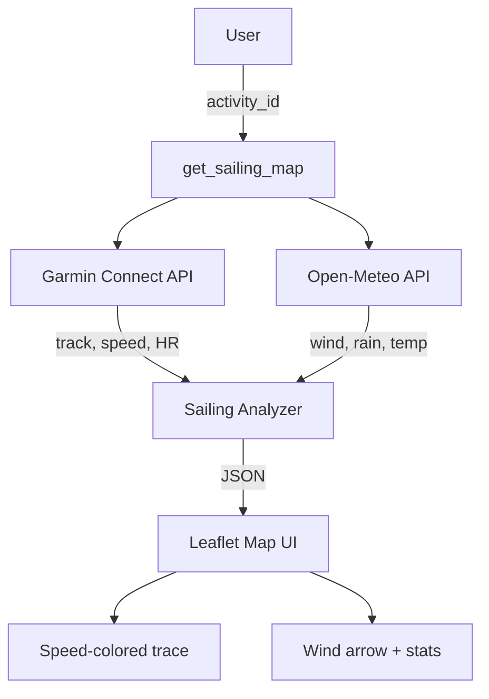

# Garmin Sailing MCP

An MCP server that turns your Garmin watch into a sailing analytics tool. Combines GPS data from Garmin Connect with historical weather from [Open-Meteo](https://open-meteo.com) to give you sailing-specific insights — all accessible through Claude.

## What it does

| Tool | Description |
|---|---|
| `get_sailing_activities` | List your recent sailing sessions |
| `get_sailing_activity` | Detailed analysis: speed (knots), distance (nm), VMG, wind, tacks, point of sail |
| `get_sailing_map` | Interactive map with GPS trace colored by speed + wind overlay |

### Sailing analysis includes

- **Speed** in knots, distance in nautical miles
- **Wind conditions** during your sail (speed, direction, gusts) via Open-Meteo
- **VMG** (Velocity Made Good) — how efficiently you sailed relative to wind
- **Maneuver detection** — tack and jibe count from heading changes
- **Point of sail distribution** — % time close hauled, beam reach, broad reach, running
- **Storm indicators** — precipitation, cloud cover, CAPE
- **Heart rate** stats

## Architecture



## Setup

### 1. Clone and install

```bash
git clone https://github.com/YOUR_USERNAME/garmin-sailing-mcp.git
cd garmin-sailing-mcp
python -m venv .venv
source .venv/bin/activate
pip install -e .
```

### 2. Authenticate with Garmin

```bash
python -m garmin_sailing setup
```

This will ask for your Garmin Connect email and password (+ MFA if enabled). Tokens are stored locally in `~/.garminconnect`.

### 3. Add to Claude Desktop

Edit `~/Library/Application Support/Claude/claude_desktop_config.json`:

```json
{
  "mcpServers": {
    "garmin-sailing": {
      "command": "/path/to/garmin-sailing-mcp/.venv/bin/python",
      "args": ["-m", "garmin_sailing", "serve"],
      "env": {
        "PYTHONUNBUFFERED": "1"
      }
    }
  }
}
```

Replace `/path/to/garmin-sailing-mcp` with the actual path where you cloned the repo.

Restart Claude Desktop and you're ready to sail!

## Usage

Just talk to Claude:

- *"How was my last sailing session?"*
- *"Show me the map of my latest sail"*
- *"Compare my last 5 sailing activities"*
- *"What were the wind conditions during my sail on March 7?"*

## Requirements

- Python 3.11+
- A Garmin watch that records sailing activities
- Claude Desktop (for the interactive map) or Claude Code

## Credits

- [garminconnect](https://github.com/cyberjunky/python-garminconnect) — Garmin Connect API client
- [Open-Meteo](https://open-meteo.com) — Free weather API (no key needed)
- [FastMCP](https://gofastmcp.com) — MCP server framework
- [Leaflet](https://leafletjs.com) — Interactive maps
