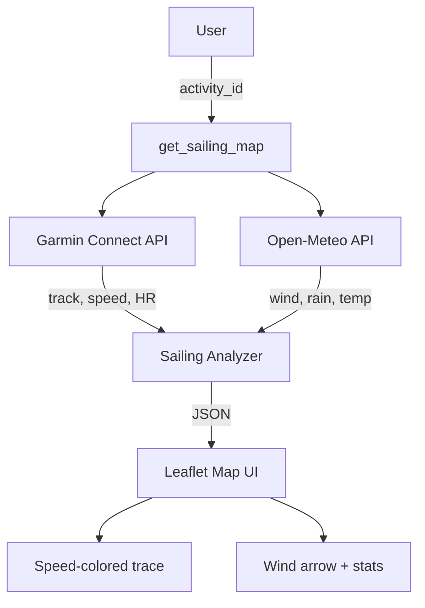

# Sailing Map Tool - Architecture

```mermaid
graph TD
    A[User] -->|activity_id| B[get_sailing_map]
    B --> C[Garmin Connect API]
    B --> D[Open-Meteo API]
    C -->|track, speed, HR| E[Sailing Analyzer]
    D -->|wind, rain, temp| E
    E -->|JSON| F[Leaflet Map UI]
    F --> G[Speed-colored trace]
    F --> H[Wind arrow + stats]
```
